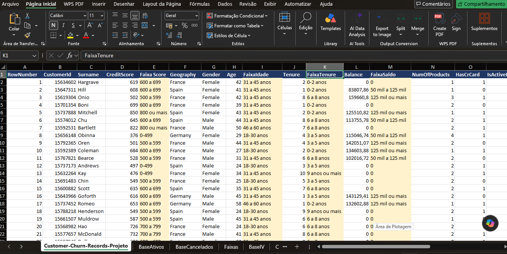
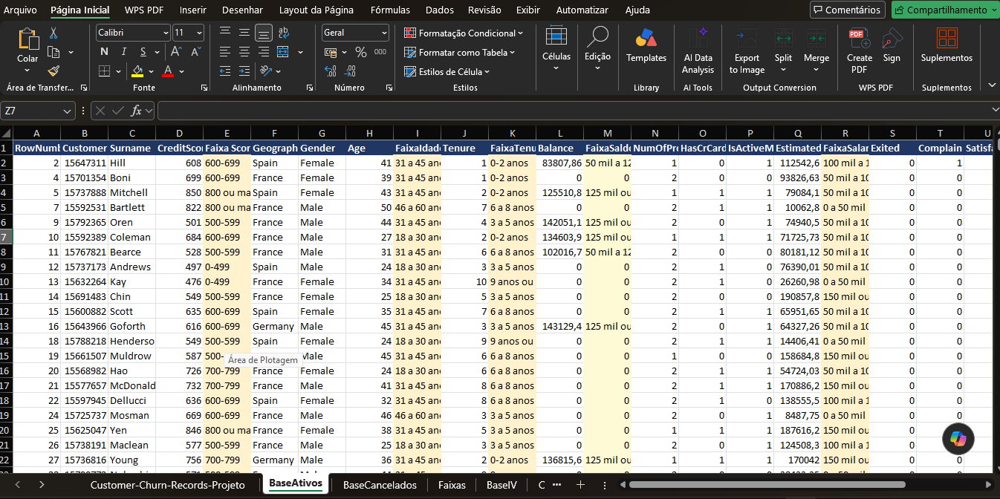
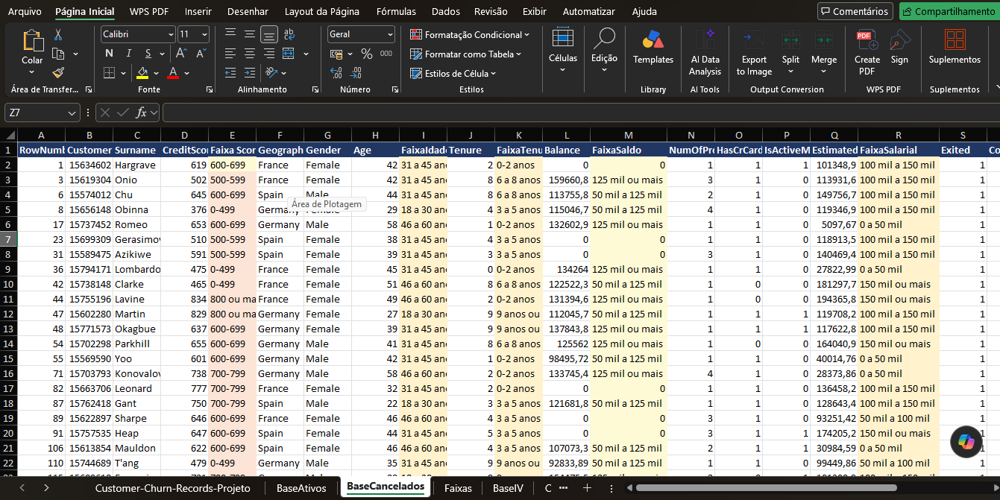
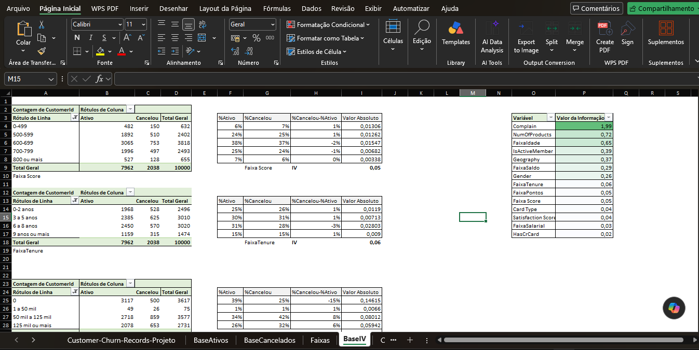
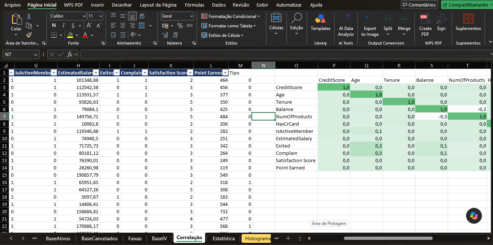
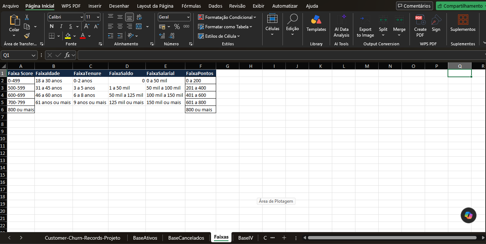
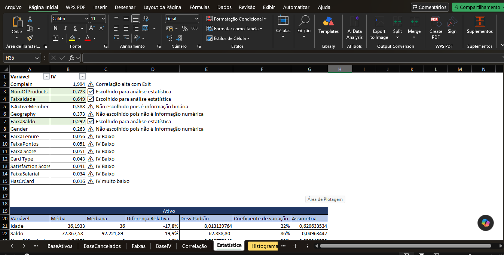
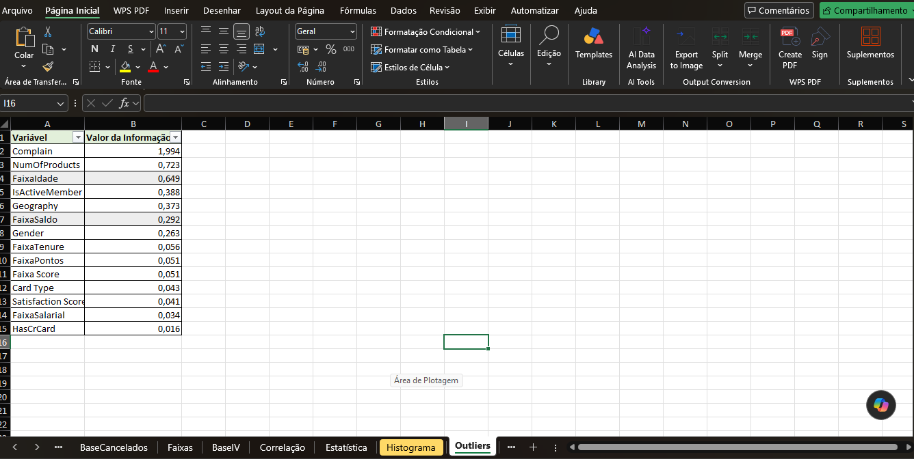

# 📊 Customer Churn Analytics: Preditividade & Inteligência de Retenção


Análise diagnóstica, estatística e preditiva desenvolvida para identificar os fatores críticos associados à evasão de clientes (*churn*) em uma instituição bancária. O projeto integra **engenharia de recursos**, **discretização/binning de dados**, **análise de correlação**, **tratamento rigoroso de outliers via IQR** e **mensuração do Valor da Informação (IV)**.

---

## 🖼️ Galeria de Evidências Visuais & Arquitetura da Planilha

### 1. Base Pronta com Engenharia de Atributos
Tratamento e enriquecimento de dados originais com a criação de faixas operacionais (`FaixaIdade`, `FaixaScore`, `FaixaTenure`, `FaixaSaldo`, `FaixaSalarial`, `FaixaPontos`).



---

### 2. Segmentação de Coortes (Ativos vs. Cancelados)
Separação clara da base de clientes para análise comparativa de comportamento e perfil de evasão.

| Clientes Ativos | Clientes Cancelados |
| :---: | :---: |
|  |  |

---

### 3. Matriz de Cálculos de Information Value (IV)
Mapeamento do poder de separação entre clientes Ativos vs. Cancelados por categoria de atributo.



---

### 4. Matriz de Correlação & Regras de Categorização
Análise de correlação entre variáveis contínuas e estruturação das tabelas de domínios (*binning*).

| Matriz de Correlação | Regras de Faixas |
| :---: | :---: |
|  |  |

---

### 5. Triagem & Critério Técnico de Seleção de Atributos
Classificação das variáveis disponíveis com regras explícitas de inclusão/exclusão baseadas no IV.



* **`Complain` (IV = 1,994):** Identificado como *data leakage* (correlação extrema/direta com a saída do cliente), isolado das análises secundárias.
* **`NumOfProducts` (IV = 0,723) & `FaixaIdade` (IV = 0,649):** Selecionados devido ao altíssimo valor preditivo sem contaminação direta.
* **`IsActiveMember` (IV = 0,388) & `Geography` (IV = 0,373):** Relevantes para estratégias de engajamento e segmentação regional.

---

### 6. Diagnóstico Estatístico de Outliers & Boxplots
Aplicação do método do **Intervalo Interquartil (IQR)** para identificação de limites e presença de anomalias em variáveis contínuas (`Idade` e `Balance`).

| Análise de Outliers | Gráficos Boxplot & Quartis |
| :---: | :---: |
|  |  |

---

## 📌 Visão Geral & Contexto de Negócio

O Custo de Aquisição de Clientes (CAC) no setor bancário exige estratégias ativas de retenção. Este estudo analisa a carteira para responder a três perguntas principais:
1. **Quais variáveis demográficas e operacionais segregam clientes propensos ao churn?**
2. **Qual é o impacto real de cada atributo no risco final de cancelamento?**
3. **Como orientar ações preventivas direcionadas para maximizar o retorno das campanhas de retenção?**

---

## 📐 Metodologia Estatística (IV & WoE)

Para avaliar o poder de discriminação das variáveis em relação à variável resposta (`Exited`: 0 = Ativo, 1 = Cancelado), utilizou-se o cálculo de **Information Value (IV)**:

$$IV = \sum_{i=1}^{k} \left( \% \text{Ativos}_i - \% \text{Cancelados}_i \right) \times \ln \left( \frac{\% \text{Ativos}_i}{\% \text{Cancelados}_i} \right)$$

### Régua de Preditividade do IV:
* **$< 0{,}02$**: Inútil / Sem poder preditivo
* **$0{,}02 \text{ a } 0{,}10$**: Poder preditivo fraco
* **$0{,}10 \text{ a } 0{,}30$**: Poder preditivo médio
* **$0{,}30 \text{ a } 0{,}50$**: Poder preditivo forte
* **$> 0{,}50$**: Poder preditivo muito alto (*exige análise de risco de vazamento de dados*)

---

## 📊 Summary das Variáveis Analisadas

| Variável | Valor de IV | Classificação | Ação / Diagnóstico |
| :--- | :---: | :---: | :--- |
| **Complain** | **1,994** | Extremo (Leakage) | Descartado da modelagem direta devido à correlação quase perfeita com cancelamento. |
| **NumOfProducts** | **0,723** | Muito Alta | Selecionado. Forte indicador de retenção por engajamento de produto. |
| **FaixaIdade** | **0,649** | Muito Alta | Selecionado. Faixa de 46 a 60 anos apresenta maior taxa proporcional de cancelamento. |
| **IsActiveMember** | **0,388** | Forte | Indicador funcional binário de engajamento operacional. |
| **Geography** | **0,373** | Forte | Discrepância geográfica marcante na operação (especialmente Alemanha). |
| **FaixaSaldo** | **0,292** | Média | Selecionado para análise quantitativa de patrimônio sob custódia. |
| **FaixaTenure** | **0,056** | Fraca | Baixa diferenciação por tempo de relacionamento isolado. |
| **FaixaScore** | **0,051** | Fraca | Score de crédito isolado não segrega risco de churn. |

---

## 📂 Estrutura do Repositório

```text
customer-churn-analytics/
├── data/
│   ├── raw/                  # Datasets brutos (Customer-Churn-Records)
│   └── processed/            # Datasets tratados e enriquecidos
├── notebooks/                # Jupyter Notebooks com análises suplementares em Python
├── reports/
│   └── figures/              # Capturas das evidências técnicas e gráficos (.png)
├── .gitignore                # Controle de exclusão do Git
├── README.md                 # Documentação executiva, estatística e visual
└── requirements.txt          # Bibliotecas do ambiente Python
🛠️ Tecnologias & Ferramentas Utilizadas
Microsoft Excel / WPS Spreadsheets: Tabela Dinâmica, Fórmulas Estatísticas, Quartis, Correlação, Tratamento de Outliers.

Python (Data Stack): pandas, numpy, matplotlib, seaborn para validação e automação.

Git & GitHub: Versionamento de código e documentação técnica responsiva.

🚀 Como Executar o Projeto Localmente
Clonar o repositório:

Bash
git clone [https://github.com/Edilson-5762/customer-churn-analytics.git](https://github.com/Edilson-5762/customer-churn-analytics.git)
cd customer-churn-analytics
Visualizar a Planilha de Análise:

Acesse a pasta data/raw/ e abra o arquivo Excel principal para inspecionar todas as abas e memórias de cálculo.

Executar o ambiente Python:

Bash
pip install -r requirements.txt
jupyter notebook
📱 Design Responsivo: Este repositório foi formatado para garantir legibilidade ideal em dispositivos móveis, tablets e telas widescreen.